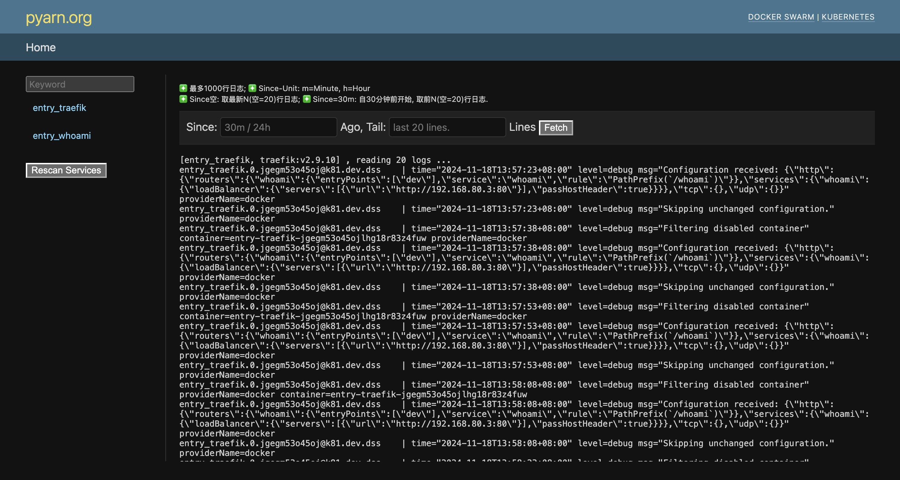

## What Is Pylon?
Pylon is a tool for viewing logs in both Docker Swarm and Kubernetes.

## Screenshot:

## Getting started

### Setup

Clone code to your Docker Swarm manager node or Your Kubernetes Master node. 
- `git clone https://github.com/softyum/pylon.git`

Create & active a new Python virtual environment, and install requirements.
- `python -m venv .venv`
- `source .venv/bin/activate`
- `pip install -r requirements.txt`

### Create a django user.

Run django command to create a user.
- `./manage createsuperuser`
Follow django guide to input username, email and password.

### Run and have a look

Start Pylong
- `./manage runserver`
Open browser and type url like `http://127.0.0.1:8006`

